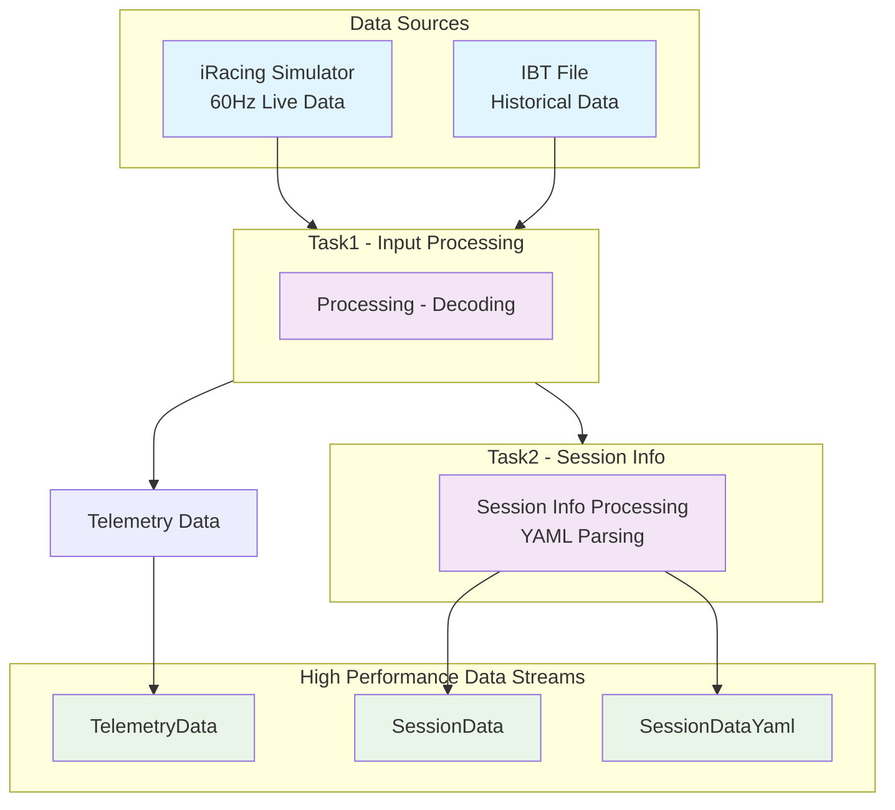
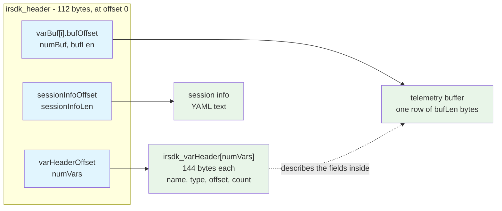

# Architecture and Design

This document describes the SDK's threading model, data pipeline, memory layout, buffering policy, and performance instrumentation.

For installation and everyday usage, see the [README](./README.md). For direct stream access and multi-consumer patterns, see [Advanced Usage](./docs/ADVANCED.md).

## Table of Contents

- [Design Principles](#design-principles)
- [Data Flow](#data-flow)
- [Data Layout](#data-layout)
- [Compile-Time Code Generation](#compile-time-code-generation)
- [Data Streaming and Buffering](#data-streaming-and-buffering)
- [Performance Characteristics](#performance-characteristics)
- [Performance Monitoring](#performance-monitoring)

## Design Principles

- **Compile-time telemetry types**: The source generator emits the requested telemetry schema; the runtime does not discover it through reflection.
- **Bounded, non-blocking streams**: Producers do not wait for slow consumers. Full channels discard the oldest unread item.
- **Independent processing paths**: Telemetry decoding and session-info parsing execute on separate tasks.
- **Recency over completeness**: The real-time path preserves current data at the cost of older unread samples under sustained backpressure.

## Data Flow

iRacing exposes live telemetry through shared memory at 60 Hz and persists recorded telemetry in IBT files. Both sources enter the same provider pipeline and feed independent output streams.



**Task1** handles source reads and telemetry decoding. **Task2** publishes raw session YAML and parses it into `SessionData`. The separation keeps YAML parsing latency out of the telemetry path.

Live data and IBT playback share a data-provider abstraction and expose the same client API.

## Data Layout

The live memory-mapped file and IBT files use the same iRacing structures. The SDK reads both directly from unmanaged memory.

The header is an index of offsets and counts. Region extents are derived from the referenced metadata.



### IBT file layout

An IBT file contains fixed metadata followed by a contiguous sequence of telemetry records:

```
             ┌────────────────────────────────────┐
0            │ irsdk_header                112 B  │
             ├────────────────────────────────────┤
112          │ irsdk_diskSubHeader          32 B  │ IBT only
             ├────────────────────────────────────┤
144          │ irsdk_varHeader[numVars]           │ numVars x 144 B
             │                                    │
             ├────────────────────────────────────┤
sessionInfo  │ session info (YAML)                │ sessionInfoLen B
Offset       │                                    │
             ├────────────────────────────────────┤
varBuf[0]    │ record 0                           │ bufLen B
.bufOffset   ├────────────────────────────────────┤
             │ record 1                           │ bufLen B
             ├────────────────────────────────────┤
             │ ...                                │
             ├────────────────────────────────────┤
             │ record n-1                         │ n = sessionRecordCount
             └────────────────────────────────────┘ = end of file
```

Regions are packed without padding or alignment:

```
varHeaderOffset   == 144                                   (immediately after the sub header)
sessionInfoOffset == 144 + numVars * 144                   (immediately after the varHeaders)
bufOffset         == sessionInfoOffset + sessionInfoLen    (immediately after the YAML)
fileLength        == bufOffset + sessionRecordCount * bufLen
```

Example layout with 264 variables and 123,937 records:

```
offset            size          region
─────────────────────────────────────────────────────────────────
0                  112          irsdk_header
112                 32          irsdk_diskSubHeader
144             38,016          irsdk_varHeader[264]      264 x 144
38,160          26,463          session info (YAML)
64,623     127,655,110          records                   123,937 x 1,030
                                                          ─────────────
                                             end of file  127,719,733
```


### Live in-memory layout

The live map (`Local\IRSDKMemMapFileName`) uses the same header, session info, variable headers, and telemetry data, but reserves fixed-capacity regions. Header offsets are stable during a session. `sessionInfoLen` is the reserved capacity, not the current YAML string length.


```
             ┌────────────────────────────────────┐
0            │ irsdk_header                112 B  │
             ├────────────────────────────────────┤
112          │ session info (YAML)                │ 512 KB reserved
             │   ...null padded...                │
             ├────────────────────────────────────┤
524,400      │ irsdk_varHeader[numVars]           │ 576 KB reserved
             │   ...unused...                     │ room for 4,096 entries
             ├────────────────────────────────────┤
1,114,224    │ telemetry buffer 0                 │ 24 KB reserved
             ├────────────────────────────────────┤
1,138,800    │ telemetry buffer 1                 │ 24 KB reserved
             ├────────────────────────────────────┤
1,163,376    │ telemetry buffer 2                 │ 24 KB reserved
             └────────────────────────────────────┘ 1,187,952
```

iRacing rotates writes across `numBuf` telemetry buffers.

| Field | Meaning |
|---|---|
| `curBuf` | index of the buffer most recently written |
| `curBufTickCount` | tick count of that buffer |
| `varBuf[i].tickCountBegin` | set *before* a write starts, where `tickCount` is set *after* it completes |


### Reading a telemetry row

A telemetry row contains `bufLen` bytes of packed values. Each `irsdk_varHeader` entry defines a variable's type, offset, and element count:

```
irsdk_varHeader - 144 bytes                     a row of bufLen bytes
┌──────────────────────────┐                    ┌─────────────────────────┐
│ type    (irsdk_VarType)  │                 0  │ SessionTime  (double)   │
│ offset  ─────────────────┼──────┐             ├─────────────────────────┤
│ count   (array length)   │      │          8  │ SessionTick  (int)      │
│ countAsTime              │      │             ├─────────────────────────┤
│ name[32]  "Speed"        │      │         12  │ ...                     │
│ desc[64]                 │      │             ├─────────────────────────┤
│ unit[32]  "m/s"          │      └────────> n  │ Speed        (float)    │
└──────────────────────────┘                    ├─────────────────────────┤
                                                │ ...                     │
                                                └─────────────────────────┘
```

Element sizes are 1 byte for `irsdk_char` and `irsdk_bool`, 4 bytes for `irsdk_int`, `irsdk_bitField`, and `irsdk_float`, and 8 bytes for `irsdk_double`. A variable occupies `count * elementSize` bytes at `offset`; `count > 1` denotes an array, including the per-car `CarIdx*` variables.

### Structure sizes

| Structure | Size | Live | IBT |
|---|---|---|---|
| `irsdk_header` | 112 bytes | yes | yes |
| `irsdk_diskSubHeader` | 32 bytes | | yes, at offset 112 |
| `irsdk_varHeader` | 144 bytes | yes | yes |
| `irsdk_varBuf` | 16 bytes | yes | yes |

## Compile-Time Code Generation

For schemas known at compile time, the SDK uses a Roslyn source generator. A `RequiredTelemetryVars` attribute defines the requested schema:

```csharp
[RequiredTelemetryVars([TelemetryVar.IsOnTrackCar, TelemetryVar.RPM, TelemetryVar.Speed, TelemetryVar.PlayerTrackSurface])]
```

The generator emits a `TelemetryData` record struct containing those fields:

```csharp
public record struct TelemetryData
{
    public bool? IsOnTrackCar { get; init; }
    public float? RPM { get; init; }
    public float? Speed { get; init; }
    public TrackLocation? PlayerTrackSurface { get; init; }
}
```

The generated type provides the following runtime characteristics:

- No reflection or dictionary lookup in the telemetry path.
- Variable names and types are validated at compile time.
- Only requested variables are decoded.
- The generated API is available to the compiler and IDE tooling.

Each sample is copied from mapped memory into a reused buffer. The live provider detects writes that overlap the copy and retries to avoid exposing a torn sample. Requested fields are then decoded from that buffer through `ReadOnlySpan<T>`, without per-field copies or allocations.

For schemas selected at runtime, `GetTelemetryVariables()` exposes the available variable metadata and `GetValue(string)` reads a value by name. Dynamic lookup requires `TelemetryDeliveryMode.Synchronous`; `DynamicTelemetryData` can be used as the client type when no generated fields are required.

## Data Streaming and Buffering

In the default `TelemetryDeliveryMode.Async` mode, application-facing streams use bounded channels with a drop-oldest policy.

- Each application-facing channel has capacity for 60 items. For telemetry, this is equivalent to one second at the live 60 Hz rate.
- Reads are FIFO and destructive.
- A write to a full channel discards the oldest unread sample.
- Memory usage and producer latency remain bounded when a consumer falls behind.

This policy favors recency over complete delivery. Consumers that require lossless processing must read the streams promptly and provide an appropriate downstream buffer; see [Advanced Usage](./ADVANCED.md).

Async mode supports handler-based consumption through `Monitor(handlers, ct)` and direct access to each stream. In `TelemetryDeliveryMode.Synchronous`, telemetry samples are delivered inline to `OnTelemetryUpdate`; the producer does not read the next sample until the handler completes. `TelemetryData` is unavailable in synchronous mode. Both delivery modes accept cancellation through `CancellationToken`.

## Performance Characteristics

- IBT processing throughput exceeds 600,000 records per second in the referenced benchmark.
- The same benchmark measured approximately twice the throughput of the previous event-based implementation.
- Bounded channels prevent consumer backpressure from blocking source reads.
- The telemetry path has near-zero steady-state allocation.

Actual throughput depends on the requested schema, consumer work, storage, and host hardware.

## Performance Monitoring

The SDK publishes runtime instrumentation through `System.Diagnostics.Metrics`.

### Available Metrics

Available instruments:

- `telemetry_records_processed_total`: processed telemetry records
- `telemetry_processing_duration_microseconds`: telemetry processing duration
- `sessioninfo_records_processed_total`: processed session-info updates
- `sessioninfo_processing_duration_milliseconds`: session-info processing duration

### Enabling Metrics with Dependency Injection

```csharp
using Microsoft.Extensions.DependencyInjection;
using Microsoft.Extensions.Hosting;
using Microsoft.Extensions.Logging;

[RequiredTelemetryVars([TelemetryVar.Speed, TelemetryVar.RPM])]
public class Program
{
    public static async Task Main(string[] args)
    {
        var host = Host.CreateDefaultBuilder(args)
            .ConfigureServices((context, services) =>
            {
                services.AddMetrics();
                services.AddLogging(logging => logging.AddConsole());
            })
            .Build();

        var logger = host.Services.GetRequiredService<ILogger<Program>>();
        var meterFactory = host.Services.GetRequiredService<IMeterFactory>();

        var clientOptions = new ClientOptions { MeterFactory = meterFactory };
        await using var client = TelemetryClient<TelemetryData>.Create(logger, null, clientOptions);
    }
}
```

### Monitoring with dotnet-counters

Any `System.Diagnostics.Metrics` consumer can collect these instruments. For example, `dotnet-counters` can attach to a running process:

```bash
# Monitor all SDK metrics for a running application named "YourApp"
dotnet-counters monitor --name "YourApp" --counters SVappsLAB.iRacingTelemetrySDK

# Sample output:
# [SVappsLAB.iRacingTelemetrySDK]
#     telemetry_records_processed_total                    45,231
#     sessioninfo_records_processed_total                      12
```

Processing rates, latency distributions, and dropped-record counts identify whether the producer or a downstream consumer is the limiting stage.

## Related Documentation

- **[README](./README.md)** - Installation, quick start, and telemetry variables
- **[Advanced Usage](./docs/ADVANCED.md)** - Direct stream access, multiple consumers, and cancellation behavior
- **[Migration Guide](./docs/MIGRATION_GUIDE.md)** - Upgrading from early pre-1.0 releases
- **[SDK usage guide for agents](./docs/ai/SDK_USAGE.md)** - Recommended usage for consumer applications
