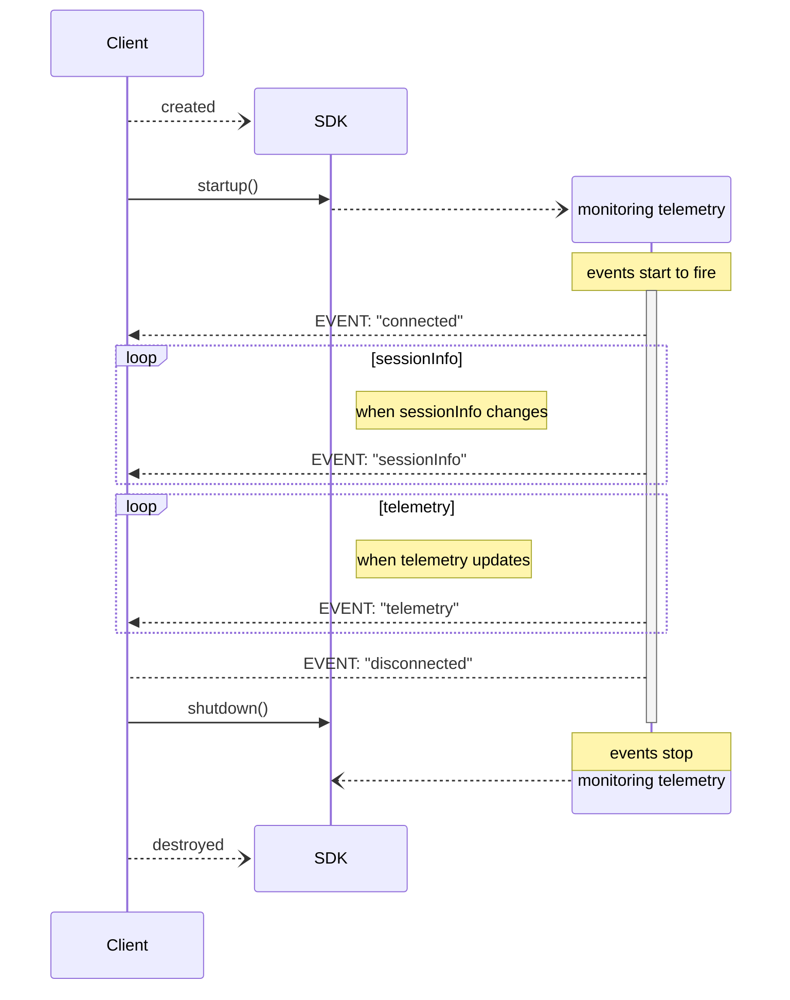

# iRacingTelemetrySDK

**iRacingTelemetrySDK** is a .Net SDK tailored for C# developers aiming to incorporate telemetry data from the iRacing simulator into their software projects.

## Features

- **Live Telemetry Data**: facilitates easy retrieval of telemetry information generated during iRacing sessions, including vehicle speed, engine RPM, tire temperatures, and more.

- **Playback of saved IBT Telemetry Data:** In addition to live data access, the SDK can read previously saved iRacing IBT files and play them back as if it were live data, using the same API.
This allows you to analyze and process historical telemetry data, the same way you would with live data.

- **Optimized Performance:** The SDK uses techniques such as asynchronous Task's, ref struct's and ReadOnlySpan's to minimize memory allocations and maximize performance.
When processing IBT files for example, the SDK is able to process 1 hour of saved telemetry data in under 1/2 second. A rate of over 300,000 telemetry records/sec.

- **Strongly Typed Telemetry Data**: Source Generation is used to create a strongly typed `TelemetryData` struct, with the iRacing variables you choose.

## Getting Started

To incorporate **iRacingTelemetrySDK** into your projects, follow these steps:

1. **Install the Package:** Add the **iRacingTelemetrySDK** NuGet package to your project using your preferred package manager.

    ```
    dotnet add package SVappsLAB.iRacingTelemetrySDK
    ```

1. Add the **RequiredTelemetryVars** attribute to the main class of your project

    The attribute takes an array of strings.  The string values, are the name of the iRacing variables you want to use in your program.

    ```csharp
    // these are the telemetry variables we want to track
    [RequiredTelemetryVars(["gear", "isOnTrackCar", "rpm", "speed"])]

    internal class Program
    {
      ...
    }
    ```

    A source generator will be leveraged to create a new .Net `TelemetryData` type you can use in your code.  For the attribute above, the created type will look like

    ```csharp
    public record struct TelemetryData(Int32 Gear,Boolean IsOnTrackCar,Single RPM,Single Speed);
    ```
1. Create an instance of the TelemetryClient

    The logger is required, but the IBT file is optional.

    ```csharp
    ILogger logger;
    string ibtFile;

    using var tc = TelemetryClient<TelemetryData>.Create(logger, ibtFile);
    ```

    If the IBT file is provided, telemetry data will be read from the file.<br/>
    If no IBT file is provided, the SDK will connect to the running instance of IRacing.

1. Add an event handler

    The event handler will be called with the latest telemetry data.
    
    ```csharp
    // event handler
    void OnTelemetryUpdate(object? _sender, TelemetryData e)
    {
        // do something with the telemetry data
        logger.LogInformation("gear: {gear}, rpm: {rpm}, speed: {speed}", e.Gear, e.RPM, e.Speed);
    }
    ```

1. Monitor for telemetry data changes

    Once monitoring is initiated, the events will fire and your event handlers will be called.<br>
    Monitoring is stopped, when the `CancellationToken` is cancelled, or the when the end-of-file is reached when processing a IBT file.

    ```csharp
    CancellationTokenSource cts = new new CancellationTokenSource();

    // start monitoring the telemetry
    await tc.Monitor(cts.Token);
    ```

## Samples

See [./Samples/README.md](Samples/README.md) for a list of example projects using the SDK

## Event Sequence Diagram

The following shows how the events are 



## License

This project is licensed under the Apache License. Refer to the [LICENSE](LICENSE) file for details.
