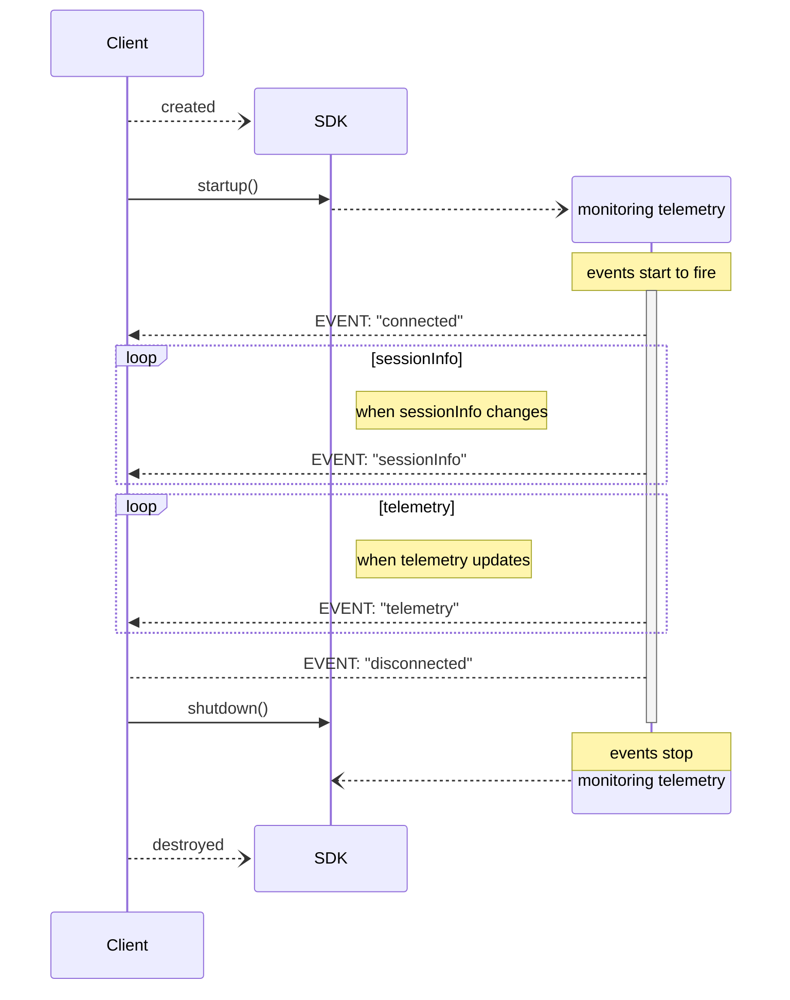

# iRacingTelemetrySDK

**iRacingTelemetrySDK** is a .Net SDK tailored for C# developers aiming to incorporate telemetry data from the iRacing simulator into their software projects.

## Features

- **Live Telemetry Data**: facilitates easy retrieval of telemetry information generated during iRacing sessions, including vehicle speed, engine RPM, tire temperatures, and more.

- **Playback of saved IBT Telemetry Data:** In addition to live data access, the SDK can read previously saved iRacing IBT files and play them back as if it were live data, using the same API.
This allows you to analyze and process historical telemetry data, the same way you would with live data.

- **Strongly Typed Telemetry Data**: Source Generation creates strongly typed iRacing variables with nullable properties that accurately reflect iRacing's dynamic variable availability model.

- **High-Performance Architecture:** The SDK uses channel-based data streaming, expression trees, and lock-free data structures to maximize performance.
When processing IBT files, the SDK can process over one-half million telemetry records/sec - double the previous performance.

- **Pause and Resume:** Control telemetry event firing with `Pause()` and `Resume()` methods. Background processing continues while paused, but events are suppressed until resumed.

- **Built-in Metrics:** Integrated System.Diagnostics.Metrics support provides detailed performance monitoring of telemetry processing, including throughput, processing duration, and dropped records.

## Telemetry Variables

The iRacing simulator generates extensive telemetry data. This SDK lets you select which telemetry data you want to track and generates a strongly-typed struct with named variables you can access directly in your project.

### Availability

iRacing outputs different variables depending on the context. Some variables available in live sessions might not be available in offline IBT files, and vice versa.

To check variable availability, use the [./Samples/DumpVariables_DumpSessionInfo](https://github.com/SVappsLAB/iRacingTelemetrySDK/tree/main/Samples/DumpVariables_DumpSessionInfo) utility. This will generate a CSV file listing available variables and a YAML file with complete session info.

Once you know what variables are available and you have the list of which ones you want to use, you're ready to start using the SDK.

## Getting Started

> ⚠️ **v1.0+ Breaking Changes**: This version introduces significant API changes with enum-based variable identification and channel-based data streaming. If upgrading from a previous version, see [MIGRATION_GUIDE.md](./MIGRATION_GUIDE.md) for detailed migration instructions.

To incorporate **iRacingTelemetrySDK** into your projects, follow these steps:

> 📚 **For comprehensive documentation and advanced usage patterns**, see [AI_CONTEXT.md](./AI_CONTEXT.md) - a detailed guide designed for developers and AI coding assistants.

1. **Install the Package:** Add the **iRacingTelemetrySDK** NuGet package to your project using your preferred package manager.

    ```
    dotnet add package SVappsLAB.iRacingTelemetrySDK
    ```

1. Add the **RequiredTelemetryVars** attribute to the main class of your project

    The attribute takes an array of TelemetryVar enum values. These enum values identify the iRacing telemetry variables you want to use in your program.

    ```csharp
    // these are the telemetry variables we want to track
    [RequiredTelemetryVars([TelemetryVar.IsOnTrackCar, TelemetryVar.RPM, TelemetryVar.Speed, TelemetryVar.PlayerTrackSurface])]

    internal class Program
    {
      ...
    }
    ```

    A source generator will be leveraged to create a new .Net `TelemetryData` type you can use in your code.  For the attribute above, the created type will look like

    ```csharp
    public record struct TelemetryData
    {
        public bool? IsOnTrackCar { get; init; }
        public float? RPM { get; init; }
        public float? Speed { get; init; }
        public irsdk_TrkLoc? PlayerTrackSurface { get; init; }
    }
    ```
1. Create an instance of the TelemetryClient

    The TelemetryClient runs in one of two modes: Live or IBT file playback.

	For live telemetry, you only need to provide a logger.

	```csharp
	// live telemetry
	using var tc = TelemetryClient<TelemetryData>.Create(logger);
	```

    For IBT playback, provide the path to the IBT file and an optional playback speed multiplier.  The speed multiplier will speed up or slow down the playback of the IBT file.<br/>
    A speed of `1` will play the IBT file at the normal speed iRacing output the file (60 records/sec).  A speed of `20` will playback the file at 20x speed (20*60=1200 records/rec).<br/>
    To play the file at maximum speed, use `int.MaxValue` as the multiplier value.

	```csharp
	// process the IBT file at 10x speed
    var ibtOptions = new IBTOptions(@"C:\path\to\file.ibt", 10);
	using var tc = TelemetryClient<TelemetryData>.Create(logger, ibtOptions);
	```

1. Subscribe to data streams

    The new channel-based API provides data streams for different types of telemetry information.
    
    ```csharp
    // Subscribe to all data streams with delegate methods for simplified consumption
    var subscriptionTask = client.SubscribeToAllStreamsAsync(
        onTelemetryUpdate: OnTelemetryUpdate,
        onSessionInfoUpdate: OnSessionInfoUpdate,
        onConnectStateChanged: OnConnectStateChanged,
        onError: OnError,
        cancellationToken: cts.Token);

    // Event handler methods
    static void OnTelemetryUpdate(TelemetryData data)
    {
        // Note: Properties are nullable, use conditional operators or check for null
        logger.LogInformation("rpm: {rpm}, speed: {speed}, track surface: {trksuf}", 
            data.RPM, data.Speed, data.PlayerTrackSurface);
    }
    
    static void OnSessionInfoUpdate(TelemetrySessionInfo session)
    {
        var driverCount = session.DriverInfo?.Drivers?.Count ?? 0;
        logger.LogInformation("Drivers in session: {count}", driverCount);
    }
    
    static void OnConnectStateChanged(ConnectStateChangedEventArgs state)
    {
        logger.LogInformation("Connection state: {state}", state.State);
    }
    
    static void OnError(ExceptionEventArgs error)
    {
        logger.LogError(error.Exception, "SDK Error occurred");
    }
    ```

1. Monitor for data changes

    The client runs two concurrent tasks: monitoring telemetry data and consuming the data streams.<br>
    Monitoring stops when the `CancellationToken` is cancelled (or when end-of-file is reached for IBT files).

    ```csharp
    using var cts = new CancellationTokenSource();

    // Enable graceful shutdown with Ctrl+C
    Console.CancelKeyPress += (_, e) => { e.Cancel = true; cts.Cancel(); };

    // Start both monitoring and subscription tasks concurrently
    await Task.WhenAny(tc.Monitor(cts.Token), subscriptionTask);
    ```

## Performance Monitoring

The SDK includes built-in support for System.Diagnostics.Metrics to help monitor performance and diagnose issues.

### Available Metrics

The SDK exposes several metrics automatically:

- **telemetry_records_processed_total**: Counter of processed telemetry records
- **telemetry_records_dropped_total**: Counter of dropped records (when channels are full)
- **telemetry_processing_duration_microseconds**: Histogram of telemetry processing time
- **sessioninfo_records_processed_total**: Counter of session info updates processed
- **sessioninfo_processing_duration_milliseconds**: Histogram of session info processing time

### Enabling Metrics with Dependency Injection

```csharp
using Microsoft.Extensions.DependencyInjection;
using Microsoft.Extensions.Hosting;
using Microsoft.Extensions.Logging;

[RequiredTelemetryVars([TelemetryVar.Speed, TelemetryVar.RPM])]
public class Program
{
    public static async Task Main(string[] args)
    {
        var host = Host.CreateDefaultBuilder(args)
            .ConfigureServices((context, services) =>
            {
                services.AddMetrics();  // Enable metrics support
                services.AddLogging(logging => logging.AddConsole());
            })
            .Build();

        var logger = host.Services.GetRequiredService<ILogger<Program>>();
        var meterFactory = host.Services.GetRequiredService<IMeterFactory>();

        // Create client with metrics support
        var clientOptions = new ClientOptions { MeterFactory = meterFactory };
        using var client = TelemetryClient<TelemetryData>.Create(logger, clientOptions);

        // Your telemetry code here...
    }
}
```

### Monitoring with dotnet-counters

Use any monitoring tool that supports System.Diagnostics.Metrics, like OpenTelemetry or the free Microsoft provided `dotnet-counters` tool to monitor SDK performance in real-time:

```bash
# Monitor all SDK metrics for a running application named "YourApp"
dotnet-counters monitor --name "YourApp" --counters SVappsLAB.iRacingTelemetrySDK

# Sample output:
# [SVappsLAB.iRacingTelemetrySDK]
#     telemetry_records_processed_total                    45,231
#     telemetry_records_dropped_total                           0
#     sessioninfo_records_processed_total                      12
```

This helps identify performance bottlenecks, monitor processing rates, and detect if records are being dropped due to slow consumption.

## Samples

See [./Samples/README.md](https://github.com/SVappsLAB/iRacingTelemetrySDK/tree/main/Samples/README.md) for a list of example projects using the SDK

## Event Sequence Diagram

The following shows how the events are 



## License

This project is licensed under the Apache License. Refer to the [LICENSE](https://github.com/SVappsLAB/iRacingTelemetrySDK/blob/main/LICENSE) file for details.
