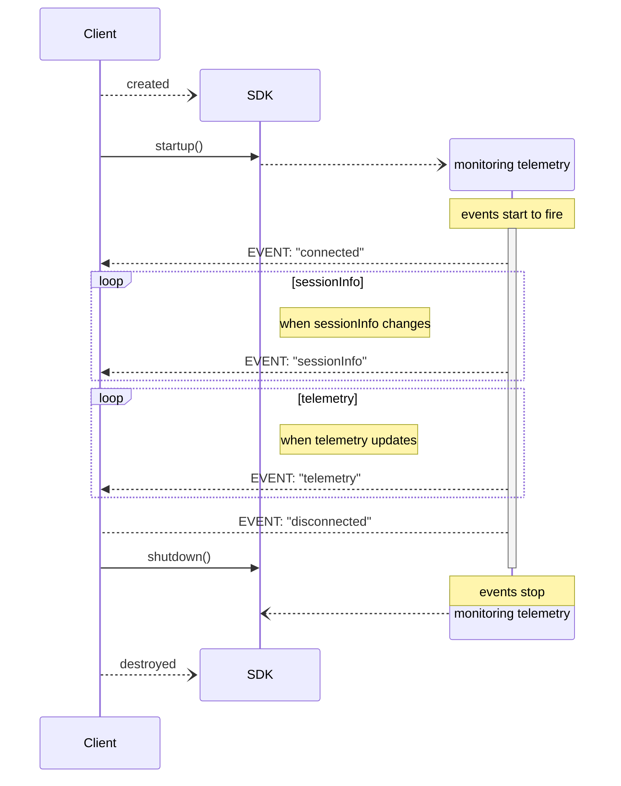

# iRacingTelemetrySDK

**iRacingTelemetrySDK** is a .Net SDK tailored for C# developers aiming to incorporate telemetry data from the iRacing simulator into their software projects.

## Features

- **Live Telemetry Data**: facilitates easy retrieval of telemetry information generated during iRacing sessions, including vehicle speed, engine RPM, tire temperatures, and more.

- **Playback of saved IBT Telemetry Data:** In addition to live data access, the SDK can read previously saved iRacing IBT files and play them back as if it were live data, using the same API.
This allows you to analyze and process historical telemetry data, the same way you would with live data.

- **Strongly Typed Telemetry Data**: Source Generation is used to create strongly typed iRacing variables, such as Floats (speed, rpm) and Enums (track surface, pit service state).

- **Optimized Performance:** The SDK uses techniques such as asynchronous Task's, ref struct's and ReadOnlySpan's to minimize memory allocations and maximize performance.
When processing IBT files for example, the SDK is able to process 1 hour of saved telemetry data in under 1/2 second. A rate of over 300,000 telemetry records/sec.

- **Pause and Resume:** Control telemetry event firing with `Pause()` and `Resume()` methods. Background processing continues while paused, but events are suppressed until resumed.

## Telemetry Variables

The iRacing simulator generates extensive telemetry data. This SDK lets you select which telemetry data you want to track and generates a strongly-typed struct with named variables you can access directly in your project.

### Availability

iRacing outputs different variables depending on the context. Some variables available in live sessions might not be available in offline IBT files, and vice versa.

To check variable availability, use the [./Samples/DumpVariables_DumpSessionInfo](https://github.com/SVappsLAB/iRacingTelemetrySDK/tree/main/Samples/DumpVariables_DumpSessionInfo) utility. This will generate a CSV file listing available variables and a YAML file with complete session info.

Once you know what variables are available and you have the list of which ones you want to use, you're ready to start using the SDK.

## Getting Started

To incorporate **iRacingTelemetrySDK** into your projects, follow these steps:

1. **Install the Package:** Add the **iRacingTelemetrySDK** NuGet package to your project using your preferred package manager.

    ```
    dotnet add package SVappsLAB.iRacingTelemetrySDK
    ```

1. Add the **RequiredTelemetryVars** attribute to the main class of your project

    The attribute takes an array of strings.  The string values, are the name of the iRacing telemetry variables you want to use in your program.

    ```csharp
    // these are the telemetry variables we want to track
    [RequiredTelemetryVars(["isOnTrackCar", "rpm", "speed", "PlayerTrackSurface"])]

    internal class Program
    {
      ...
    }
    ```

    A source generator will be leveraged to create a new .Net `TelemetryData` type you can use in your code.  For the attribute above, the created type will look like

    ```csharp
    public record struct TelemetryData(Boolean IsOnTrackCar,Single RPM,Single Speed, irsdk_TrkLoc PlayerTrackSurface);
    ```
1. Create an instance of the TelemetryClient

    The TelemetryClient runs in one of two modes: Live or IBT file playback.

	For live telemetry, you only need to provide a logger.

	```csharp
	// live telemetry
	using var tc = TelemetryClient<TelemetryData>.Create(logger);
	```

    For IBT playback, provide the path to the IBT file and an optional playback speed multiplier.  The speed multiplier will speed up or slow down the playback of the IBT file.<br/>
    A speed of `1` will play the IBT file at the normal speed iRacing output the file (60 records/sec).  A speed of `20` will playback the file at 20x speed (20*60=1200 records/rec).<br/>
    To play the file at maximum speed, use `int.MaxValue` as the multiplier value.

	```csharp
	// process the IBT file at 10x speed
    var ibtOptions = new IBTOptions(@"C:\path\to\file.ibt", 10);
	using var tc = TelemetryClient<TelemetryData>.Create(logger, ibtOptions);
	```

1. Add an event handler

    The event handler will be called with the latest telemetry data.
    
    ```csharp
    // event handler
    void OnTelemetryUpdate(object? _sender, TelemetryData e)
    {
        // do something with the telemetry data
        logger.LogInformation("rpm: {rpm}, speed: {speed}, track surface: {trksuf}", e.RPM, e.Speed, e.PlayerTrackSurface);
    }
    ```

1. Monitor for telemetry data changes

    Once monitoring is initiated, the events will fire and your event handlers will be called.<br>
    Monitoring is stopped, when the `CancellationToken` is cancelled, or the when the end-of-file is reached when processing a IBT file.

    ```csharp
    CancellationTokenSource cts = new new CancellationTokenSource();

    // start monitoring the telemetry
    await tc.Monitor(cts.Token);
    ```

## Samples

See [./Samples/README.md](https://github.com/SVappsLAB/iRacingTelemetrySDK/tree/main/Samples/README.md) for a list of example projects using the SDK

## Event Sequence Diagram

The following shows how the events are 



## License

This project is licensed under the Apache License. Refer to the [LICENSE](https://github.com/SVappsLAB/iRacingTelemetrySDK/blob/main/LICENSE) file for details.
