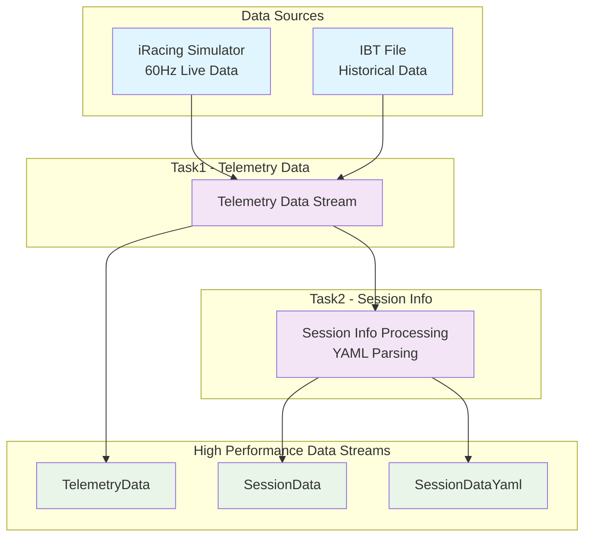

# iRacing Telemetry SDK for C# .NET

High-performance .NET SDK for accessing **live telemetry data** from iRacing simulator and **IBT file playback**. Features compile-time code generation for strongly-typed telemetry access with lock-free performance optimizations.

[](https://www.nuget.org/packages/SVappsLAB.iRacingTelemetrySDK)
[](LICENSE)

Perfect for building **real-time dashboards**, **data analysis tools**, **race engineering applications**, and **telemetry visualizations**.

## Table of Contents

- [Features](#features)
- [Requirements](#requirements)
- [Quick Example](#quick-example)
- [Getting Started](#getting-started)
- [Understanding Telemetry Variables](#understanding-telemetry-variables)
- [Samples](#samples)
- [Advanced Usage](./docs/ADVANCED.md)
- [Documentation](#documentation)
- [AI-Assisted Development](#ai-assisted-development)
- [Performance and Design](#performance-and-design)
- [Performance Monitoring](#performance-monitoring)
- [Building from Source](#building-from-source)
- [License](#license)

## Features

- **Type Safety**: Enum-based telemetry variables with IntelliSense support and compile-time validation
- **High Performance**: Processes 600,000+ telemetry records/second with lock-free data streaming architecture
- **Background Processing**: Dedicated threads for telemetry collection and processing - your app's processing speed never blocks the streaming telemetry data
- **Live Telemetry**: Real-time access to 200+ variables including speed, RPM, tire data during iRacing sessions
- **IBT File Playback**: Analyze historical telemetry using the same API as live data
- **Modern Async API**: Async data streams with automatic backpressure handling
- **Built-in Metrics**: Integrated performance monitoring via System.Diagnostics.Metrics
- **Pause and Resume**: Control data flow while background processing continues

## Requirements

- **.NET 8.0+**
- **Windows** for live iRacing telemetry

## Quick Example

```csharp
using Microsoft.Extensions.Logging;
using SVappsLAB.iRacingTelemetrySDK;

[RequiredTelemetryVars([TelemetryVar.Speed, TelemetryVar.RPM])]

public class Program
{
    public static async Task Main()
    {
        var logger = LoggerFactory.Create(b => b.AddConsole()).CreateLogger("App");
        await using var client = TelemetryClient<TelemetryData>.Create(logger);

        using var cts = new CancellationTokenSource();

        var handlers = new TelemetryHandlers<TelemetryData>
        {
            OnTelemetryUpdate = data =>
            {
                Console.WriteLine($"Speed: {data.Speed}, RPM: {data.RPM}");
                return Task.CompletedTask;
            }
        };

        await client.Monitor(handlers, cts.Token);
    }
}
```

## Getting Started

To incorporate **iRacingTelemetrySDK** into your projects, follow these steps:

1. **Install the Package:** Add the **iRacingTelemetrySDK** NuGet package to your project using your preferred package manager.

    ```
    dotnet add package SVappsLAB.iRacingTelemetrySDK
    ```

1. Add the **RequiredTelemetryVars** attribute to the main class of your project

    The attribute takes an array of TelemetryVar enum values. These enum values identify the iRacing telemetry variables you want to use in your program.

    ```csharp
    // these are the telemetry variables we want to track
    [RequiredTelemetryVars([TelemetryVar.IsOnTrackCar, TelemetryVar.RPM, TelemetryVar.Speed, TelemetryVar.PlayerTrackSurface])]

    internal class Program
    {
      ...
    }
    ```

    A source generator will be leveraged to create a new .NET `TelemetryData` type you can use in your code.  For the attribute above, the created type will look like

    ```csharp
    public record struct TelemetryData
    {
        public bool? IsOnTrackCar { get; init; }
        public float? RPM { get; init; }
        public float? Speed { get; init; }
        public TrackLocation? PlayerTrackSurface { get; init; }
    }
    ```
1. Create an instance of the TelemetryClient

    The TelemetryClient implements `IAsyncDisposable` and should be used with `await using` for proper resource cleanup.

    The TelemetryClient runs in one of two modes: Live or IBT file playback.

    **For live telemetry**, you only need to provide a logger:

    ```csharp
    // Live telemetry from iRacing
    await using var tc = TelemetryClient<TelemetryData>.Create(logger);
    ```

    **For IBT playback**, provide the path to the IBT file and an optional playback speed multiplier:

    ```csharp
    // Process IBT file at 10x speed
    var ibtOptions = new IBTOptions(@"C:\path\to\file.ibt", 10);
    await using var tc = TelemetryClient<TelemetryData>.Create(logger, ibtOptions);

    // Maximum speed processing (the default)
    var fastOptions = new IBTOptions(@"C:\path\to\file.ibt", int.MaxValue);
    await using var fastTc = TelemetryClient<TelemetryData>.Create(logger, fastOptions);
    ```

    **Speed multiplier values:**
    - `1` = Normal speed (60 records/sec)
    - `20` = 20x speed (1,200 records/sec)
    - `int.MaxValue` = Maximum speed processing

1. Subscribe to data streams

    Pass a `TelemetryHandlers<T>` to `Monitor(...)`; it consumes the streams for you and returns when monitoring ends:

    ```csharp
    var handlers = new TelemetryHandlers<TelemetryData>
    {
        OnTelemetryUpdate = data =>
        {
            // Properties are nullable - handle accordingly
            var speed = data.Speed?.ToString("F1") ?? "N/A";
            var rpm = data.RPM?.ToString("F0") ?? "N/A";

            logger.LogInformation("Speed: {speed} mph, RPM: {rpm}", speed, rpm);
            return Task.CompletedTask;
        },
        OnSessionInfoUpdate = session =>
        {
            var driverCount = session.DriverInfo?.Drivers?.Count ?? 0;
            logger.LogInformation("Drivers in session: {count}", driverCount);
            return Task.CompletedTask;
        },
        OnConnectStateChanged = state =>
        {
            logger.LogInformation("Connection: {state}", state);
            return Task.CompletedTask;
        },
        OnError = error =>
        {
            logger.LogError(error, "Telemetry error");
            return Task.CompletedTask;
        }
    };

    await tc.Monitor(handlers, cts.Token);
    ```

    > **`OnError` vs. handler exceptions:** `OnError` receives only *SDK-side* processing errors (for example a failed YAML parse or a read error). Exceptions thrown by your own handler code are **not** routed to `OnError` — they fault the `Monitor(...)` call directly so bugs surface loudly rather than being silently swallowed. If a handler has recoverable per-item failures, wrap that work in a `try/catch` inside the handler.

    Need multiple independent consumers, custom backpressure, or maximum IBT throughput? See **[Advanced usage](./docs/ADVANCED.md)**.

1. Monitor for data changes

    The client uses multiple tasks (multi-threading) to monitor all iRacing data. Monitoring stops when the `CancellationToken` is cancelled (or when end-of-file is reached for IBT files).

    ```csharp
    using var cts = new CancellationTokenSource();

    // cancel on Ctrl+C
    Console.CancelKeyPress += (_, e) => { e.Cancel = true; cts.Cancel(); };

    await tc.Monitor(handlers, cts.Token);
    ```

## Understanding Telemetry Variables

### Telemetry Variables

The iRacing simulator generates extensive telemetry data. This SDK lets you select which telemetry data you want to track and generates a strongly-typed struct with named variables you can access directly in your project.

#### Availability

iRacing outputs different variables depending on the context. Some variables available in live sessions might not be available in offline IBT files, and vice versa.

To check variable availability, use the [./Samples/DumpVariables_DumpSessionInfo](https://github.com/SVappsLAB/iRacingTelemetrySDK/tree/main/Samples/DumpVariables_DumpSessionInfo) utility. This will generate a CSV file listing available variables and a YAML file with complete session info.

Once you know what variables are available and you have the list of which ones you want to use, you're ready to start using the SDK.

#### Nullable Properties

All telemetry properties are nullable (`float?`, `int?`, `bool?`) to accurately represent iRacing's variable availability model. Some variables are only available in certain sessions or contexts.

**Recommended patterns for handling null values:**

```csharp
// ✅ Null-conditional formatting
var speedDisplay = $"Speed: {data.Speed?.ToString("F1") ?? "N/A"}";

// ✅ Direct arithmetic (preserves null semantics)
var speedMph = data.Speed * 2.23694f; // Result is null if Speed is null

// ✅ Explicit null handling
var speed = data.Speed ?? 0f;
var hasValue = data.Speed.HasValue;

// ✅ Boolean checks
if (data.IsOnTrackCar == true) { /* ... */ }
```

## Samples

See [Samples Directory](./Samples/README.md) for ready-to-run example projects including:
- Basic telemetry monitoring
- IBT file analysis
- Data export utilities
- Track analysis tools

## Documentation

- **[Advanced Usage](./docs/ADVANCED.md)** - Direct stream access, multiple consumers, and cancellation behavior
- **[Migration Guide](./docs/MIGRATION_GUIDE.md)** - Upgrading from early pre-1.0 releases

## AI-Assisted Development

To use this repo as part of your own consuming application, point your AI coding agent to these repository docs:

- **[SDK usage guide for agents](./docs/ai/SDK_USAGE.md)** - Recommended usage for consumer applications.
- **[Advanced SDK reference for agents](./docs/ai/SDK_REFERENCE.md)** - Advanced stream, metrics, DI, and troubleshooting patterns.

To have your agent use them automatically, add a line like this to your project's `AGENTS.md`, `CLAUDE.md`, or `.cursorrules` (your agent needs the ability to fetch URLs):

```
When working with the iRacing Telemetry SDK, read
https://raw.githubusercontent.com/SVappsLAB/iRacingTelemetrySDK/main/docs/ai/SDK_USAGE.md first,
and https://raw.githubusercontent.com/SVappsLAB/iRacingTelemetrySDK/main/docs/ai/SDK_REFERENCE.md for advanced patterns.
```

## Performance and Design

The SDK is designed for high performance with bounded async data streaming that keeps telemetry current under load.

### Data Streaming Benefits

**Data Safety:**
- **60-sample ring buffer** with FIFO (First-In-First-Out) and destructive-read semantics
- Provides **up to 1 second** of buffering at iRacing's 60Hz update rate
- When the buffer fills, **oldest unread samples are automatically dropped** to make room for new data
- **Drop-oldest strategy** ensures the SDK never blocks and prioritizes the most recent telemetry

**Performance:**
- **Lock-free operations** eliminate blocking and contention
- **Asynchronous processing** keeps your main thread responsive
- **~2x performance improvement** over traditional event-based approaches
- **600,000+ records/sec** processing capability for IBT files

**Flexibility:**
- **Two consumption patterns**: Handler callbacks (`Monitor(handlers, ct)`) or direct stream access
- **Independent streams**: Consume only the data types you need
- **Cancellation support**: Graceful shutdown with `CancellationToken`

### Architecture Overview

**Key Design Principles:**

- **Strongly Typed Telemetry Data**: Use strong type checking throughout
- **Non-blocking Streams**: All real-time data flows through asynchronous data streams
- **Separation of Concerns**: Telemetry data (high-frequency, time-critical) and Session Info processing (low frequency, CPU-intensive) run independently
- **Background Processing**: CPU-intensive YAML parsing runs on a separate thread to prevent any telemetry data drops.


```mermaid
graph TB
    subgraph "Data Sources"
        iRacing[iRacing Simulator<br/>60Hz Live Data]
        IBT[IBT File<br/>Historical Data]
    end

    subgraph "Task1 - Telemetry Data"
        MainTask[Telemetry Data Stream]
    end

    subgraph "Task2 - Session Info"
        SessionTask[Session Info Processing<br/>YAML Parsing]
    end

    subgraph "High Performance Data Streams"
        TelemetryStream[TelemetryData]
        SessionStream[SessionData]
        RawStream[SessionDataYaml]
    end

    iRacing --> MainTask
    IBT --> MainTask

    MainTask --> TelemetryStream
    MainTask --> SessionTask
    SessionTask --> SessionStream
    SessionTask --> RawStream

    classDef dataSource fill:#e1f5fe
    classDef processing fill:#f3e5f5
    classDef stream fill:#e8f5e8

    class iRacing,IBT dataSource
    class MainTask,SessionTask processing
    class TelemetryStream,SessionStream,RawStream stream
```


### Performance Monitoring

The SDK includes built-in support for System.Diagnostics.Metrics to help monitor performance and diagnose issues.

#### Available Metrics

The SDK exposes several metrics automatically:

- **telemetry_records_processed_total**: Counter of processed telemetry records
- **telemetry_records_dropped_total**: Counter of dropped records (when channels are full)
- **telemetry_processing_duration_microseconds**: Histogram of telemetry processing time
- **sessioninfo_records_processed_total**: Counter of session info updates processed
- **sessioninfo_processing_duration_milliseconds**: Histogram of session info processing time

#### Enabling Metrics with Dependency Injection

```csharp
using Microsoft.Extensions.DependencyInjection;
using Microsoft.Extensions.Hosting;
using Microsoft.Extensions.Logging;

[RequiredTelemetryVars([TelemetryVar.Speed, TelemetryVar.RPM])]
public class Program
{
    public static async Task Main(string[] args)
    {
        var host = Host.CreateDefaultBuilder(args)
            .ConfigureServices((context, services) =>
            {
                services.AddMetrics();  // Enable metrics support
                services.AddLogging(logging => logging.AddConsole());
            })
            .Build();

        var logger = host.Services.GetRequiredService<ILogger<Program>>();
        var meterFactory = host.Services.GetRequiredService<IMeterFactory>();

        // Create client with metrics support
        var clientOptions = new ClientOptions { MeterFactory = meterFactory };
        await using var client = TelemetryClient<TelemetryData>.Create(logger, null, clientOptions);

        // Your telemetry code here...
    }
}
```

#### Monitoring with dotnet-counters

Use any monitoring tool that supports System.Diagnostics.Metrics, like OpenTelemetry or the free Microsoft provided `dotnet-counters` tool to monitor SDK performance in real-time:

```bash
# Monitor all SDK metrics for a running application named "YourApp"
dotnet-counters monitor --name "YourApp" --counters SVappsLAB.iRacingTelemetrySDK

# Sample output:
# [SVappsLAB.iRacingTelemetrySDK]
#     telemetry_records_processed_total                    45,231
#     telemetry_records_dropped_total                           0
#     sessioninfo_records_processed_total                      12
```

This helps identify performance bottlenecks, monitor processing rates, and detect if records are being dropped due to slow consumption.

## Building from Source

If you've cloned or forked the repository, you can build, test, and package the SDK with the standard .NET CLI from the repository root.

```bash
# build the SDK solution
dotnet build .\Sdk\SVappsLAB.iRacingTelemetrySDK.slnx

# build the sample solution
dotnet build .\Samples\Samples.slnx

# create a NuGet package
dotnet pack .\Sdk\SVappsLAB.iRacingTelemetrySDK\SVappsLAB.iRacingTelemetrySDK.csproj
```

### Running tests

Tests are split into categories so you can run subsets based on your environment. Live tests require iRacing to be running on Windows.

```bash
# unit tests only
dotnet test .\Sdk\tests\UnitTests\UnitTests.csproj

# repeatable offline smoke tests using bundled IBT files
dotnet run --project .\Sdk\tests\SmokeTests\SmokeTests.csproj -- --filter-trait Category=ibt

# live smoke tests, requires an active iRacing session
dotnet run --project .\Sdk\tests\SmokeTests\SmokeTests.csproj -- --filter-trait Category=live

# all test projects, including tests that may require live/manual setup
dotnet test .\Sdk\SVappsLAB.iRacingTelemetrySDK.slnx
```

See [Sdk/tests/README.md](./Sdk/tests/README.md) for manual test commands and filtering notes.

### Running the samples

```bash
# live iRacing data
dotnet run

# IBT file playback
dotnet run path/to/file.ibt
```

See the [Samples](./Samples/README.md) directory for the individual example projects.

## License

This project is licensed under the Apache License 2.0. See [LICENSE](./LICENSE) file for details.
